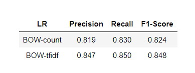
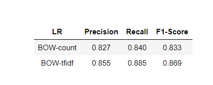
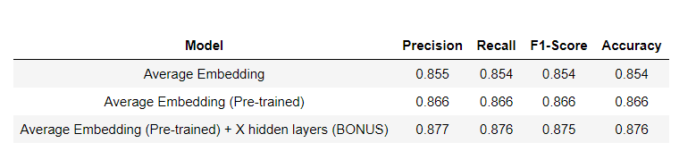

# Text Classification

## Description

The project is to develop and test two text classification systems:

**Task 1**: *sentiment analysis*, in particular to predict the sentiment of movie review, i.e. positive or negative (binary classification).

**Task 2**: *topic classification*, to predict whether a news article is about International issues, Sports or Business (multiclass classification).

We use **Logistic Regression** and **Feedforward Network** respectively to achieve this project. In addition, pure Python is used to write code to implement algorithms such as SGD.

## Requirements

- Python >= `3.5`
- Jupyter Notebook 
- `pandas`
- `matplotlib`
- `numpy`

## Implementations

### 1. Text Classification with Logistic Regression

#### Data - Task 1

The data you will use for Task 1 are taken from here: http://www.cs.cornell.edu/people/pabo/movie-review-data/ and you can find it in the `./data_sentiment` folder in CSV format:

- `data_sentiment/train.csv`: contains 1,400 reviews, 700 positive (label: 1) and 700 negative (label: 0) to be used for training.

- `data_sentiment/dev.csv`: contains 200 reviews, 100 positive and 100 negative to be used for hyperparameter selection and monitoring the training process.

- `data_sentiment/test.csv`: contains 400 reviews, 200 positive and 200 negative to be used for testing.

  

#### Data - Task 2

The data you will use for Task 2 is a subset of the [AG News Corpus](http://groups.di.unipi.it/~gulli/AG_corpus_of_news_articles.html) and you can find it in the `./data_topic` folder in CSV format:

- `data_topic/train.csv`: contains 2,400 news articles, 800 for each class to be used for training.

- `data_topic/dev.csv`: contains 150 news articles, 50 for each class to be used for hyperparameter selection and monitoring the training process.

- `data_topic/test.csv`: contains 900 news articles, 300 for each class to be used for testing.

  

#### Result

The task 1 result is as following:

The task 2 result is as following:

### 2. Text Classification with a Feedforward Network

#### Data 

- The data you will use for Task 2 is a subset of the [AG News Corpus](http://groups.di.unipi.it/~gulli/AG_corpus_of_news_articles.html) and you can find it in the `./data_topic` folder in CSV format:

  - `data_topic/train.csv`: contains 2,400 news articles, 800 for each class to be used for training.

  - `data_topic/dev.csv`: contains 150 news articles, 50 for each class to be used for hyperparameter selection and monitoring the training process.

  - `data_topic/test.csv`: contains 900 news articles, 300 for each class to be used for testing.

    

#### Pre-trained Embeddings

You can download pre-trained GloVe embeddings trained on Common Crawl (840B tokens, 2.2M vocab, cased, 300d vectors, 2.03 GB download) from [here](http://nlp.stanford.edu/data/glove.840B.300d.zip). No need to unzip, the file is large.

#### Save Memory

To save RAM, when you finish each experiment you can delete the weights of your network using `del W` followed by Python's garbage collector `gc.collect()`

#### Result

This task result is as following:

